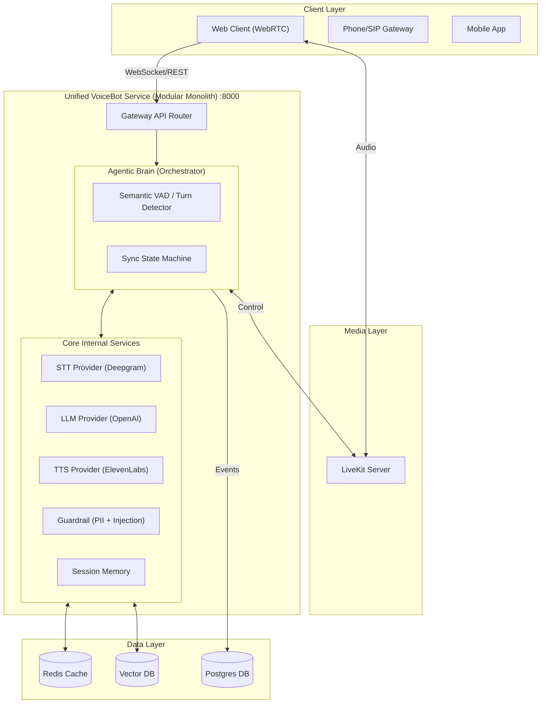

# 🧠 Agentic AI Voice Bot Platform — Architecture & Documentation

> **High-Performance Unified VoiceBot — Modular Monolith with Sub-1s Latency.**

---

## Table of Contents

1. [System Overview](#1-system-overview)
2. [Architecture Diagram](#2-architecture-diagram)
3. [Data Flow — Real-Time Voice Pipeline](#3-data-flow--real-time-voice-pipeline)
4. [Project Structure (Unified)](#4-project-structure-unified)
5. [Core Components](#5-core-components)
6. [Multi-Environment Support (Dev, UAT, Prod)](#6-multi-environment-support)
7. [Tech Stack](#7-tech-stack)
8. [Performance Optimization](#8-performance-optimization)
9. [Security](#9-security)
10. [Observability](#10-observability)
11. [Deployment](#11-deployment)

---

## 1. System Overview

The **Unified VoiceBot Service** is a high-performance "Modular Monolith" designed for real-time AI voice conversations. By consolidating 8 microservices into a single process, we achieve:

- **Ultra-low latency** (<1.0s TTFB end-to-end) by removing internal network hops.
- **Simplified Deployment** using a single port (:8000) and one process.
- **Seamless Interruption Handling** with zero-latency signal propagation.
- **Enterprise-grade Security** with in-memory PII filtering and prompt injection protection.
- **Modular Design** that can be easily split back into microservices if needed for extreme scaling.

---

## 2. Architecture Diagram



---

## 3. Data Flow — Real-Time Voice Pipeline

### Consolidated Latency Budget (Target: <0.9s)

By moving to a unified service, we eliminate the **100-200ms** of overhead caused by internal REST/WebSocket proxying between services.

| Stage | Speed | Optimization |
|---|---|---|
| Audio Capture → STT | ~150ms | Real-time PCM streaming, 20ms chunks |
| STT → Brain → Guardrail | **~0ms** | Direct async function calls (In-process) |
| Guardrail → LLM | **~0ms** | Direct object instance communication |
| LLM First Token (TTFT) | ~350ms | Streaming, optimized system prompts |
| LLM → TTS First Chunk | ~200ms | Sentence-boundary flushing (Sentence 1) |
| TTS → Audio Playback | ~200ms | Streaming audio chunks directly to client |
| **Total Response Time** | **~900ms** | **No network-serialization overhead** |

---

## 4. Project Structure (Unified)

```
agentic-voice-bot/
├── voicebot/                        # Unified service package
│   ├── main.py                      # Main entry point (FastAPI)
│   ├── api/                         # REST & WebSocket API routes
│   ├── core/                        # Orchestrator & Brain logic
│   ├── services/                    # Internal engine modules
│   │   ├── stt/                     # Speech-to-Text providers
│   │   ├── llm/                     # Language Model providers
│   │   ├── tts/                     # Text-to-Speech providers
│   │   ├── guardrail/               # PII & content safety
│   │   └── memory/                  # Persistence & caching
│   └── shared/                      # Shared models & logging
│
├── docs/                            # Architectural documentation
├── infra/                           # K8s, Prometheus, Grafana configs
├── tests/                           # Integrated test suite
├── scripts/                         # Testing & automation scripts
├── .env.dev                         # Environment: Local Development
├── .env.uat                         # Environment: User Acceptance Testing
└── .env.prod                        # Environment: Production
```

---

## 5. Core Components

### 5.1 Agentic Brain
The central state machine managing the pipeline. In the unified service, it **injects** providers (STT, LLM, TTS) as direct Python objects, allowing for zero-latency communication during the voice turn.

### 5.2 Semantic VAD
The `TurnDetector` uses linguistic heuristics to determine if a user has finished speaking, differentiating between a pause mid-sentence and the end of a thought.

### 5.3 Guardrail Protection
Real-time filtering of PII (Credit Cards, OTPs, etc.) and Prompt Injection detection (15+ patterns). Running in-process reduces check time to **<2ms**.

---

## 6. Multi-Environment Support

The platform uses a dynamic configuration system that loads the appropriate settings based on the `APP_ENV` variable.

| Environment | Use Case | Key Features |
|---|---|---|
| **DEV** | Local Coding | Debug=True, Mock providers allowed, local Redis. |
| **UAT** | User Testing | Real AI providers, staging Redis/Postgres, trace enabled. |
| **PROD** | Live Bot | Strict security, restricted logs, production Redis Cluster. |

---

## 7. Tech Stack

- **Framework**: FastAPI (Async Python 3.11+)
- **STT**: Deepgram Nova-2 (Streaming)
- **LLM**: OpenAI GPT-4o (Streaming)
- **TTS**: ElevenLabs Turbo v2 (Streaming)
- **Cache**: Redis (Session & Audio Cache)
- **Events**: Kafka (Internal audit trail)
- **Observability**: Prometheus, Grafana, Jaeger

---

## 8. Performance Optimization

- **Zero-Copy Buffering**: Audio chunks are processed as bytes without unnecessary casting.
- **Async Task Concurrency**: STT, LLM, and TTS run in parallel as `asyncio` tasks.
- **Predictive TTS**: Brain starts TTS preparation as soon as the first sentence is complete.
- **In-process Signaling**: Interruption signals travel via `asyncio.Event` across modules instantly.

---

## 9. Security

- **In-process PII Masking**: PII is scrubbed before being logged or stored in history.
- **Injection Guard**: Input is vetted before being sent to the LLM.
- **JWT Auth**: Every session is protected by a cryptographically signed token.

---

## 10. Observability

The unified server exposes a `/health` endpoint and uses **Structured JSON Logging** with Correlation IDs. This allows you to trace a single user utterance from audio capture through STT, LLM, and back to speech output in one consolidated log stream.

---

## 11. Deployment

### Local Start
```bash
export APP_ENV=dev
python -m voicebot.main
```

### Docker
```bash
docker build -t voicebot .
docker run -p 8000:8000 --env-file .env.dev voicebot
```

### Kubernetes
Expose only **Port 8000** via an Ingress with WebSocket support enabled.
