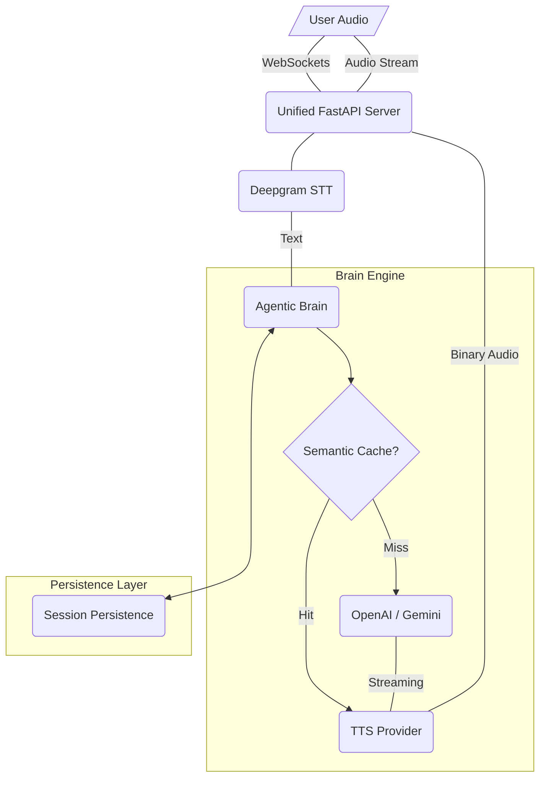
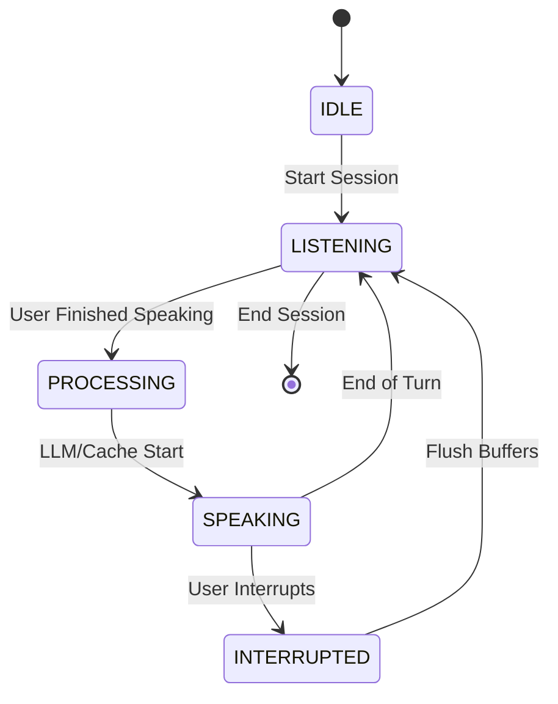

# Agentic Voice Platform: System Architecture & Flow

This document outlines the final system architecture and data flow for the Agentic Voice Laboratory, confirming that the end-to-end pipeline is fully operational.

## 🚀 1. End-to-End Voice Flow

The following diagram illustrates the high-speed data flow between the User and the Neural Engine.

### 🧠 2. Orchestrator State Machine

The `AgenticBrain` manages the conversation lifecycle using a robust state machine in `brain.py`:

## 🛠️ 3. Core Component Review

| Component | Provider(s) | Role | Optimization |
| :--- | :--- | :--- | :--- |
| **STT** | Deepgram | Streaming Transcriptions | Low-latency binary buffer pipelining. |
| **LLM** | OpenAI / Gemini | Intelligence & Reasoning | **Semantic Caching**: Redis-backed hash lookup. |
| **TTS** | ElevenLabs / Deepgram | Speech Synthesis | **Stream-through**: Bypassing disk for direct audio SSE. |
| **Memory** | Redis | Session Persistence | **History Hydration**: Multi-turn context survives restarts. |
| **Guardrail** | PII Detector | Security | Input/Output sanitization in real-time. |

## 🧪 4. Laboratory Simulator Mode

The **Laboratory UI** enables testing the pipeline via direct text input:
1.  **Simulator Input**: Bypasses the STT layer but triggers the full `LLM -> TTS` logic.
2.  **Infrastructure Test**: REST endpoints (`/api/v1/llm/test`) allow isolated verification of AI providers.
3.  **Config Hotswapping**: Providers and specific models (e.g., Gemini 2.0 Flash) are updated in the `AgenticBrain` instance during active WebSocket sessions.

---
> [!NOTE]
> **Status**: **STABLE**. End-to-end flow verified via WebSocket simulator and REST test suite.
